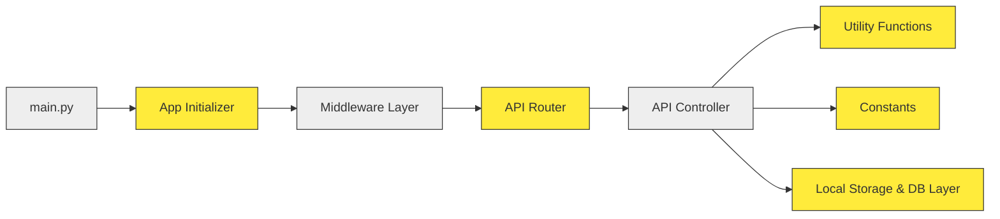

# 🚀 Shared Drive Project

A backend system for managing shared drives within a company, inspired by platforms like Google Drive.  
It offers APIs for file and folder management, sharing, permissions, and storage, with dynamic local storage and database support.

---

## 📁 Table of Contents

- [Overview](#-overview)
- [Architecture](#-architecture)
- [How It Works](#-how-it-works)
- [API Endpoints](#-api-endpoints)
- [Sharing & Permissions](#-sharing--permissions)
- [Groups & Collaboration](#-groups--collaboration)
- [Favorites & Metadata](#-favorites--metadata)
- [Storage & Logs](#-storage--logs)
- [Tech Stack](#-tech-stack)
- [Getting Started](#-getting-started)

---

## ✅ Overview

The **Shared Drive Project** provides a scalable backend architecture for cloud-based file storage and sharing systems.  
It supports individual and group file sharing, access control, file previews, and organizational file management.

---
## 🧬 Architecture


## 🧱 How It Works

### 1. API Layer
- **Router**: Defines all available endpoints.
- **Controllers**: Business logic handling request/response for each endpoint.

### 2. Middleware
- Handles authentication, logging, and any preprocessing before requests hit the controllers.

### 3. Loader
- Initializes app settings, database connections, and shared objects before the server starts.

### 4. Modules
- Contains structured logic for APIs grouped under versioning (`v1`).
- Includes schemas, models, and service functions.

### 5. Utils
- Utility functions, database connectors, common helpers.

### 6. Constants
- Central place for managing environment configs, error codes, status messages, etc.

### 7. Storage
- Manages:
  - **Local File System**: Auto-created directories for user data.
  - **Database**: Stores metadata like size, owner, access, timestamps.

---

## 🔌 API Endpoints

### 🔍 1. `POST /my_drives`
- Retrieves the user's entire drive structure including folders, files, and metadata.

### 📁 2. `POST /folder`
- Creates a new folder in the specified path.
- Automatically updates the local storage and DB.

### 📤 3. `POST /upload_item`
- Uploads files or folders.
- Supports multi-level directory structures.
- Metadata saved in DB.

### 🤝 4. `POST /sharing`
- Share an item with colleagues (other users in the company's database).
- Supports setting access levels (read/write).

### 📂 5. `POST /file_content`
- Returns the content of the file or prepares it for preview.
- Type-safe: Detects and serves supported file types (text, media, etc.).

### 📋 6. `POST /copy_item`
- Copies a file or folder and allows pasting into a new location.
- Updates DB and storage accordingly.

### ❌ 7. `DELETE /delete_item`
- Deletes a specified file or folder.
- Removes from storage and DB.

### 🔁 8. `POST /move_item`
- Moves a file or folder from one location to another.
- Validates access and updates all paths.

### 👥 9. `POST /group`
- Creates a group of colleagues.
- Useful for repeated sharing with the same set of people.

### ✏️ 10. `PUT /rename_item`
- Renames an existing file or folder.
- Ensures name uniqueness in the same directory.

### 🔄 11. `POST /modify_share`
- Modify access level (read/write) for a shared file or folder.
- Handles group or individual access.

### ⭐ 12. `POST /favourites`
- Mark an item (file/folder) as a favorite.
- Adds to user’s personalized list for quick access.


## 🔒 Sharing & Permissions

Items can be shared with:

- **Individual users**
- **Groups**

Each shared item can have:

- **Read-only access**
- **Write access**

Owners can **modify or revoke** access at any time.

---

## 👥 Groups & Collaboration

- Groups are **reusable collections of users**.
- Useful when items need to be **regularly shared** with a fixed team.
- Supports **CRUD operations** for group management.

---

## 🌟 Favorites & Metadata

Each user can **mark files/folders as favorites**.

**Metadata includes:**

- File type
- Size
- Owner
- Created date
- Shared access list

---

## 📚 Storage & Logs

### **LocalStorage**
- Automatically created when users upload or create items.
- Structure mimics a **directory tree**.

### **Logs**
- Stored in the `/logs` directory.
- Captures:
  - Error logs
  - Access logs
  - System events

---

## 🧰 Tech Stack

| Component       | Tech Used               |
|----------------|--------------------------|
| Framework       | FastAPI                  |
| Language        | Python 3.10+             |
| Database        | MongoDB                  |
| File Storage    | Local File System        |
| Documentation   | Swagger (via FastAPI)    |

---

## 🚀 Getting Started

### ✅ Prerequisites

- Python **3.10+**
- virtualenv
- MongoDB 

---

### 📦 Installation

```bash
git clone https://github.com/your-org/shared-drive.git
cd shared-drive
```
##### To install all the dependencies
```bash
pip install -r requirements.txt
```

---

### ▶️ Run the App

```bash
uvicorn main:app --reload
```
---

### ⚠️ Important Note

This project is intended to run within a **specific company or internal infrastructure**.

It requires backend services such as:

- **MongoDB** and **SQL Server** running on private IP addresses
- Internal **authentication services** and **ERP APIs**
- No **frontend/UI** is provided – this is a **backend-only system**
- Swagger docs may not be enabled (`[SWAGGER] DOCS` is empty)

